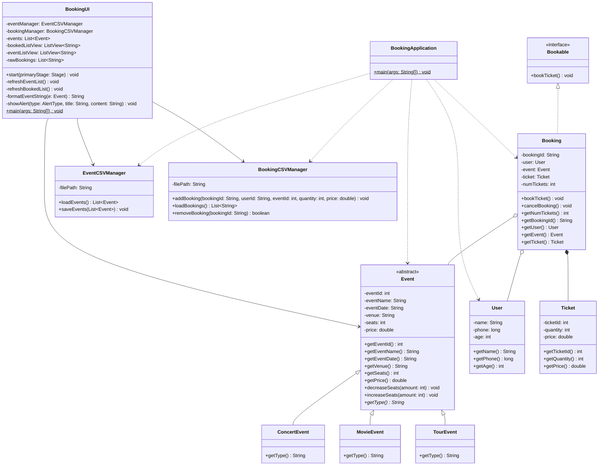

# ETBS System Architecture

## UML Class Diagram

```mermaid
classDiagram
    class Bookable {
        <<interface>>
        +bookTicket() void
    }

    class Event {
        <<abstract>>
        -eventId: int
        -eventName: String
        -eventDate: String
        -venue: String
        -seats: int
        -price: double
        +getEventId() int
        +getEventName() String
        +getEventDate() String
        +getVenue() String
        +getSeats() int
        +getPrice() double
        +decreaseSeats(amount: int) void
        +increaseSeats(amount: int) void
        +getType()* String
    }

    class ConcertEvent {
        +getType() String
    }

    class MovieEvent {
        +getType() String
    }

    class TourEvent {
        +getType() String
    }

    class User {
        -name: String
        -phone: long
        -age: int
        +getName() String
        +getPhone() long
        +getAge() int
    }

    class Ticket {
        -ticketId: int
        -quantity: int
        -price: double
        +getTicketId() int
        +getQuantity() int
        +getPrice() double
    }

    class Booking {
        -bookingId: String
        -user: User
        -event: Event
        -ticket: Ticket
        -numTickets: int
        +bookTicket() void
        +cancelBooking() void
        +getNumTickets() int
        +getBookingId() String
        +getUser() User
        +getEvent() Event
        +getTicket() Ticket
    }

    class EventCSVManager {
        -filePath: String
        +loadEvents() List~Event~
        +saveEvents(List~Event~) void
    }

    class BookingCSVManager {
        -filePath: String
        +addBooking(bookingId: String, userId: String, eventId: int, quantity: int, price: double) void
        +loadBookings() List~String~
        +removeBooking(bookingId: String) boolean
    }

    class BookingApplication {
        +main(args: String[]) void$
    }

    class BookingUI {
        -eventManager: EventCSVManager
        -bookingManager: BookingCSVManager
        -events: List~Event~
        -bookedListView: ListView~String~
        -eventListView: ListView~String~
        -rawBookings: List~String~
        +start(primaryStage: Stage) void
        -refreshEventList() void
        -refreshBookedList() void
        -formatEventString(e: Event) String
        -showAlert(type: AlertType, title: String, content: String) void
        +main(args: String[]) void$
    }

    Event <|-- ConcertEvent
    Event <|-- MovieEvent
    Event <|-- TourEvent

    Bookable <|.. Booking

    Booking o-- User
    Booking o-- Event
    Booking *-- Ticket

    BookingApplication ..> EventCSVManager
    BookingApplication ..> BookingCSVManager
    BookingApplication ..> Booking
    BookingApplication ..> User
    BookingApplication ..> Event

    BookingUI --> EventCSVManager
    BookingUI --> BookingCSVManager
    BookingUI --> Event
```
