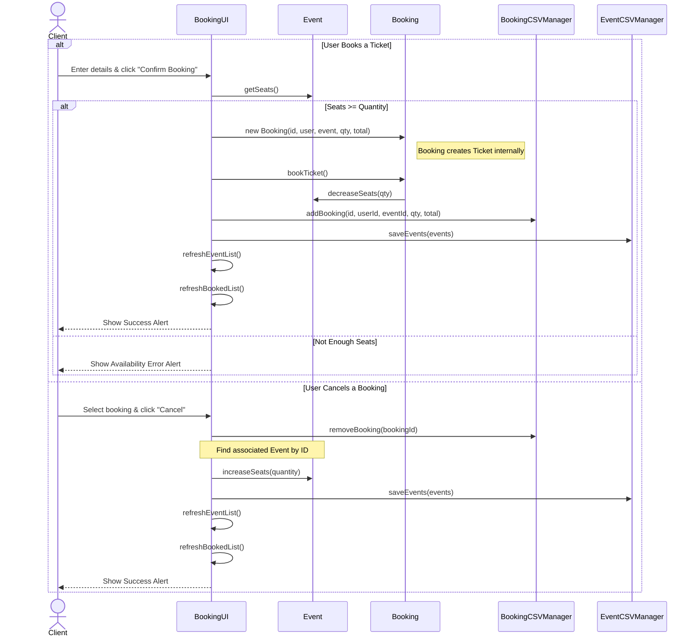

# ETBS Sequence Diagram (Combined Flow)

```mermaid
sequenceDiagram
    actor Client
    participant UI as BookingUI
    participant Evt as Event
    participant Bk as Booking
    participant BKMgr as BookingCSVManager
    participant EvtMgr as EventCSVManager

    alt User Books a Ticket
        Client->>UI: Enter details & click "Confirm Booking"
        UI->>Evt: getSeats()
        
        alt Seats >= Quantity
            UI->>Bk: new Booking(id, user, event, qty, total)
            Note right of Bk: Booking creates Ticket internally
            UI->>Bk: bookTicket()
            Bk->>Evt: decreaseSeats(qty)
            UI->>BKMgr: addBooking(id, userId, eventId, qty, total)
            UI->>EvtMgr: saveEvents(events)
            UI->>UI: refreshEventList()
            UI->>UI: refreshBookedList()
            UI-->>Client: Show Success Alert
        else Not Enough Seats
            UI-->>Client: Show Availability Error Alert
        end
        
    else User Cancels a Booking
        Client->>UI: Select booking & click "Cancel"
        UI->>BKMgr: removeBooking(bookingId)
        
        Note over UI,Evt: Find associated Event by ID
        UI->>Evt: increaseSeats(quantity)
        
        UI->>EvtMgr: saveEvents(events)
        UI->>UI: refreshEventList()
        UI->>UI: refreshBookedList()
        UI-->>Client: Show Success Alert
    end
```
